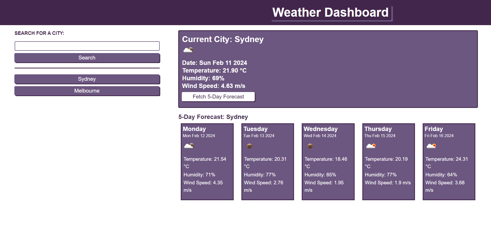

# Weather Dashboard

## Table of Contents
- [Description](#description)
- [License](#license)
- [Website Page](#website-page)
- [Installation](#installation)
- [Usage](#usage)
- [Credits](#credits)
- [Contributions](#contributions)
- [Testing](#testing)
- [Questions](#questions)

## Description

* A simple Weather Dashboard that uses OpenWeather API

### What was my motivation?

* To test my skills using Server Side APIs.

### Why did I build this project?

* To have a simple app that I can use to search the weather.

### What problem does this solve?

* Not having an app to check the weather.

### What have I learned from this project?

* How to use Server Side APIs.

## License:

This application is covered by the [MIT License](https://opensource.org/licenses/MIT).

## Website Page:

[Weather Dashboard](https://danyon-talbot.github.io/weather-dashboard/)

## Installation:

* None
## Usage:

* Use Live Website Link

## Credits:

* [OpenWeather API](https://openweathermap.org/api)

## Contributions:

* None

## Testing:

* None

## Questions

#### My GitHub Profile:
* [Danyon-Talbot](https://github.com/Danyon-Talbot)

#### Additional Questions?

* If you have any additional questions, please reach out to me here: danyon.talbot2@gmail.com
